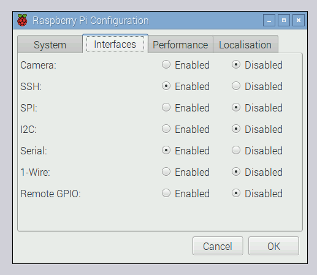

## Analogue inputs

The Raspberry Pi's GPIO pins are digital pins, so you can only set outputs to high or low, or read inputs as high or low. However, using an ADC chip (Analogue-to-Digital converter), you can read the value of analogue input devices such as potentiometers.

### SPI

The analogue values are communicated to the Pi using the SPI protocol. While this will work in GPIO Zero out of the box, you may get better results if you enable full SPI support.

--- task ---

Open a terminal window and install the `spidev` package:

```bash
sudo apt-get install python3-spidev python-spidev
```

--- /task ---

--- task ---

Open the **Raspberry Pi Configuration** dialogue from the main menu and enable **SPI** in the **Interfaces** tab:



--- /task ---

--- task ---

Click **OK** and reboot the Pi.

--- /task ---

