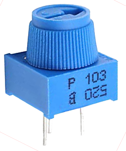

## Wiring the ADC (MCP3008)

The MCP3008 is an ADC providing eight input channels. The eight connectors on one side are connected to the Pi's GPIO pins, and the other eight are available to connect analogue input devices to read their values.

Place the MCP3008 chip on a breadboard and carefully wire it up as shown in the following diagram. You should see a small notch, or dot, in one end of the chip. In the diagram, this end of the chip is alligned with column **19** on the breadboard.

Alternatively, you could use the [Analog Zero](http://rasp.io/analogzero/){:target="_blank"} board, which provides the MCP3008 chip on a handy add-on board to save you from the complicated wiring.

### Add a potentiometer

Now that the ADC is connected to the Pi, you can wire devices up to the input channels. A potentiometer is a good example of an analogue input device: it's simply a variable resistor, and the Pi reads the voltage (from 0V to 3.3V).

A potentiometer's pins are ground, data, and 3V3. This means you connect it to ground and a supply of 3V3, and read the actual voltage from the middle pin.

--- task ---

Place a potentiometer on the breadboard and wire one side to the ground rail, the other to the 3V3 rail, and the middle pin to the first input channel as shown:

--- /task ---

Now your potentiometer is connected and its value can be read from Python. Test it now.

--- task ---

Open your code editor and start a new script.

--- /task ---

--- task ---

Start by importing the `MCP3008` class from the GPIO Zero library:

--- code ---
---
language: python
filename: main.py
line_numbers: true
line_number_start: 1
line_highlights: 
---
from gpiozero import MCP3008

--- /code ---

--- /task ---

--- task ---

Create an object representing your analogue device:

--- code ---
---
language: python
filename: main.py
line_numbers: true
line_number_start: 1
line_highlights: 2
---
from gpiozero import MCP3008
pot = MCP3008(0)

--- /code ---

    Note the `0` represents the ADC's channel 0. There are 8 channels (0 to 7), and you're using the first one.

--- /task ---

--- task ---

Try to read its value:

--- code ---
---
language: python
filename: main.py
line_numbers: true
line_number_start: 1
line_highlights: 3
---
from gpiozero import MCP3008
pot = MCP3008(0)
print(pot.value)

--- /code ---

--- /task ---

--- task ---

Run your code. You should see a number between 0 and 1. This represents how far the dial is turned.

--- /task ---

--- task ---

Now read the value in a loop:

--- code ---
---
language: python
filename: main.py
line_numbers: true
line_number_start: 1
line_highlights: 3-4
---
from gpiozero import MCP3008
pot = MCP3008(0)
while True:
    print(pot.value)

--- /code ---

Try twisting the dial around to see the value change.

--- /task ---

