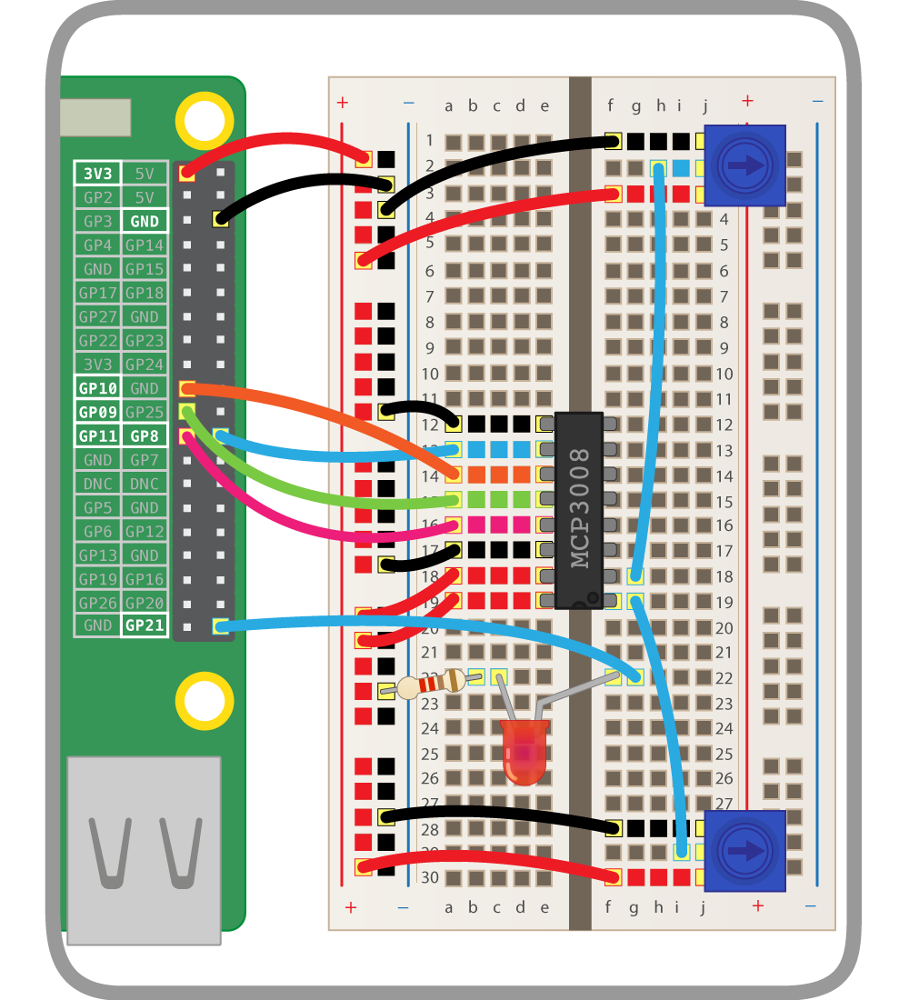

Now you've tested you can read values from the potentiometer, you should connect it to another GPIO device.

--- task ---

Add an LED to your breadboard and wire it to the Pi, connecting it to GPIO pin 21:

    

--- /task ---

--- task ---

In your Python code, start by importing the `PWMLED` class:

```python
from gpiozero import PWMLED
```

The `PWMLED` class lets you control the brightness of an LED using PWM, or pulse-width modulation.

--- /task ---

--- task ---

Create a `PWMLED` object on pin 21:

```python
led = PWMLED(21)
```

--- /task ---

--- task ---

Test you can control the LED manually:

```python
led.on()  # the led should be lit
led.off()  # the led should go off
led.value = 0.5  # the led should be lit at half brightness
```

--- /task ---

--- task ---

Now connect the LED to the potentiometer:

```python
led.source = pot.values
```

--- /task ---

--- task ---

Turn the dial to change the LED brightness!

--- /task ---


### Source and values

GPIO Zero has a powerful feature: **source and values**. Every device has a `value` property (the current value) and a `values` property (a stream of the device's values at all times). Every output device has a `source` property which can be used to set what the device's value should be.

- `pot.value` gives the potentiometer's current value (it's read only, as it's an input device)
- `led.value` is the LED's current value (it's read/write: you can see what it is, and you can change it)
- `pot.values` is a generator constantly yielding the potentiometer's current value
- `led.source` is a way of setting where the LED gets its values from

Rather than continuously setting the value of the LED to the value of the potentiometer in a loop, you can just pair the two devices. Therefore the line `led.source = pot.values` is equivalent to the following loop:

```python
while True:
    led.value = pot.value
```

### Multiple potentiometers

--- task ---

Add a second potentiometer to your breadboard and connect it to the ADC's channel 1:

    

--- /task ---

--- task ---

Now create a second `MCP3008` object on channel 1:

```python
pot2 = MCP3008(1)
```

--- /task ---

--- task ---

Make the LED blink:

    ```python
    led.blink()
    ```

    The LED will blink continuously, one second on and one second off.

--- /task ---

--- task ---

Change the `on_time` and `off_time` parameters to make it blink faster or slower:

    ```python
    led.blink(on_time=2, off_time=2)
    led.blink(on_time=0.5, off_time=0.1)
    ```

--- /task ---


--- task ---

Now use a loop to change the blink times according to the potentiometer values:

    ```python
    while True:
        print(pot.value, pot2.value)
        led.blink(on_time=pot.value, off_time=pot2.value, n=1, background=False)
    ```

    Note you have to make it blink once in the foreground, so that each iteration gets time to finish before it updates the blink times.

--- /task ---

--- task ---

Rotate the dials to make it blink at different speeds!

--- /task ---

--- task ---

Also try changing `blink` to `pulse` and change `on_time` and `off_time` to `fade_in_time` and `fade_out_time` so that it fades in and out at different speeds, rather than just blinking on and off:

    ```python
    while True:
        print(pot.value, pot2.value)
        led.pulse(fade_in_time=pot.value, fade_out_time=pot2.value, n=1, background=False)
    ```

Rotate the dials to change the effect.

--- /task ---

