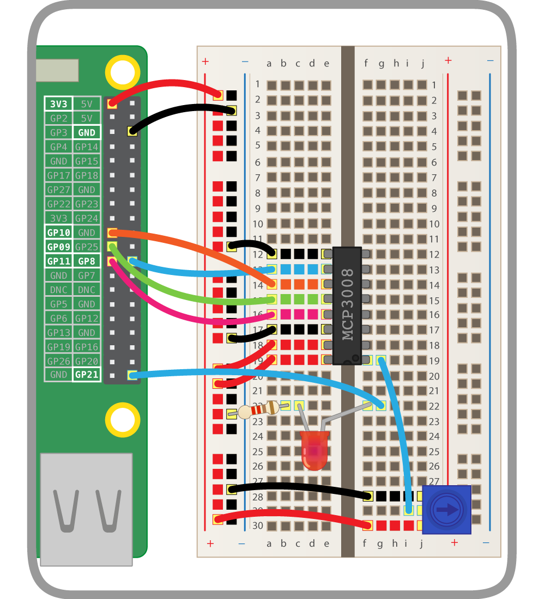

Now you've tested you can read values from the potentiometer, you should connect it to another GPIO device.

--- task ---

Add an LED to your breadboard and wire it to the Pi, connecting it to GPIO pin 21:

    

--- /task ---

--- task ---

In your Python code, start by importing the `PWMLED` class:

--- code ---
---
language: python
filename: main.py
line_numbers: true
line_number_start: 1
line_highlights:
---
from gpiozero import PWMLED

--- /code ---

The `PWMLED` class lets you control the brightness of an LED using PWM, or pulse-width modulation.

--- /task ---

--- task ---

Create a `PWMLED` object using pin 21:

--- code ---
---
language: python
filename: main.py
line_numbers: true
line_number_start: 1
line_highlights: 3
---
from gpiozero import PWMLED

led = PWMLED(21)

--- /code ---

--- /task ---

--- task ---

Test you can control the LED manually:

--- code ---
---
language: python
filename: main.py
line_numbers: true
line_number_start: 1
line_highlights: 5-7
---
from gpiozero import PWMLED

led = PWMLED(21)

led.on()  # the led should be lit
led.off()  # the led should go off
led.value = 0.5  # the led should be lit at half brightness

--- /code ---

--- /task ---

--- task ---

Now connect the LED to the potentiometer:

--- code ---
---
language: python
filename: main.py
line_numbers: true
line_number_start: 1
line_highlights: 8
---
from gpiozero import PWMLED

led = PWMLED(21)

led.on()  # the led should be lit
led.off()  # the led should go off
led.value = 0.5  # the led should be lit at half brightness
led.source = pot.values

--- /code ---

--- /task ---

--- task ---

Turn the dial to change the LED brightness!

--- /task ---


--- collapse ---
---
title: Source and values
---

GPIO Zero has a powerful feature: **source and values**. Every device has a `value` property (the current value) and a `values` property (a stream of the device's values at all times). Every output device has a `source` property which can be used to set what the device's value should be.

- `pot.value` gives the potentiometer's current value (it's read only, as it's an input device)
- `led.value` is the LED's current value (it's read/write: you can see what it is, and you can change it)
- `pot.values` is a generator constantly yielding the potentiometer's current value
- `led.source` is a way of setting where the LED gets its values from

Rather than continuously setting the value of the LED to the value of the potentiometer in a loop, you can just pair the two devices. Therefore the line `led.source = pot.values` is equivalent to the following loop:


```python
while True:
    led.value = pot.value

```

--- /collapse ---

