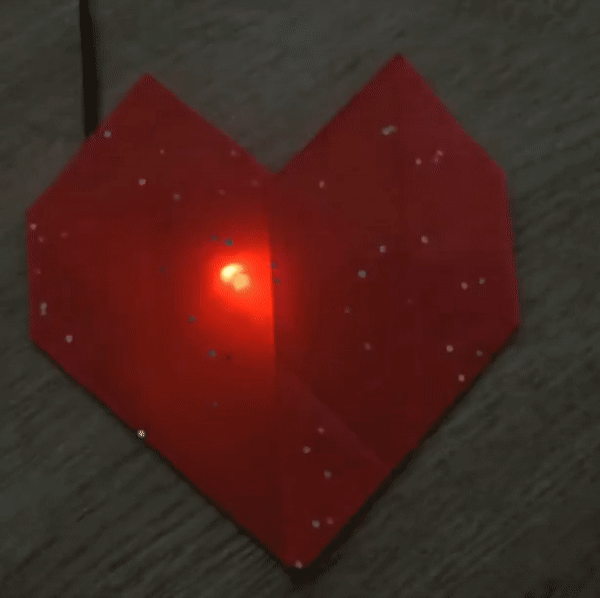

## What next?

You could have your DAC work as a dimmer for an [LED](https://projects.raspberrypi.org/en/projects/rpi-LED){:target="_blank"}, or use it to sound a [Buzzer](https://projects.raspberrypi.org/en/projects/rpi-buzzer){:target="_blank"}!

If you are looking for a longer project that uses anaologue inputs, you could try the [Beating Heart](https://projects.raspberrypi.org/en/projects/beating-heart){:target="_blank"} project. In this project, you will a papercraft beating heart with a pulsing LED and a dial to adjust the heart rate! The project is designed for Raspberry Pi Pico, but with your new ADC, you'll be able to make it with your Pi!

